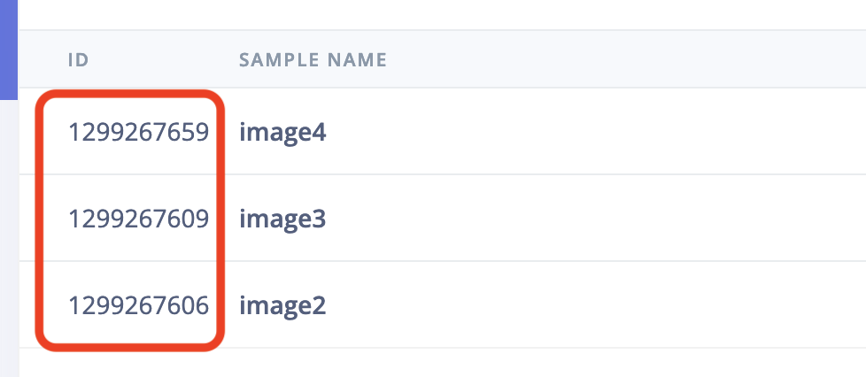

# AI Actions block: LLM-based labeling with GPT4o

This is an Edge Impulse [AI Actions block](https://docs.edgeimpulse.com/docs/edge-impulse-studio/organizations/custom-blocks/transformation-blocks) that uses GPT4o to label your image data. You can use this repo as the basis for custom tasks that use LLMs to help with labeling or data quality tasks in your project.

## Use this from Edge Impulse (professional / enterprise)

If you just want to use GPT4o as a labeling tool in your Edge Impulse project you don't need this repo. Just go to any project, select **Data acquisition > AI Actions**, choose **Label images using GPT4o** (available for professional and enterprise projects only).

## Developing your own block

You can use this repository to develop your own block that uses GPT4o (or some other LLM) to help you label data, or add metadata.

### Running this block locally

1. Create a new Edge Impulse project, and add some images.
2. Create a file called `ids.json` and add the IDs of the samples you want to label. You can find the sample ID by clicking the 'expand' button on **Data acquisiton**.

    

    Add these IDs to the `ids.json` file as an array of numbers, e.g.:

    ```json
    [1299267659, 1299267609, 1299267606]
    ```

3. Load your API keys (both Edge Impulse and OpenAI):

    ```
    export OPENAI_API_KEY=sk-M...
    export EI_PROJECT_API_KEY=ei_44...
    ```

    > You can find your OpenAI API key on the [OpenAI API Keys](https://platform.openai.com/api-keys) page. You can find your Edge Impulse API Key via **Dashboard > Keys**.

4. Install Node.js 20.
5. Build and run this project to label your data:

    ```
    npm run build
    node build/llm-labeling.js \
        --prompt "Are there airpods in this photo? If so, say 'yes'; if not, say 'no'; or if you're unsure say 'unsure'" \
        --disable-labels "unsure" \
        --concurrency 10 \
        --data-ids-file ids.json
    ```

6. Afterwards you'll have labeled data in your project.

### Pushing block to Edge Impulse (enterprise only)

If you've modified this block, you can push it back to Edge Impulse so it's available to everyone in your organization.

1. Update `parameters.json` to update the name and description of your block.
2. Initialize and push the block:

    ```
    $ edge-impulse-blocks init
    $ edge-impulse-blocks push
    ```

3. Afterwards, you can run your block through **Data acquisition > AI Actions** in any Edge Impulse project.

### Proposed changes

AI Actions blocks should be able to run in 'preview' mode (triggered when you click *Label preview data* in the Studio) - where changes are _staged_ but not directly applied. If this is the case `--propose-actions <job-id>` is passed into your block. When you see this flag you should not apply changes directly (e.g. via `api.rawData.editLabel`) but rather use the `setSampleProposedChanges` API. Search for this API in [llm-labeling.ts](llm-labeling.ts) to see how this should be used.
